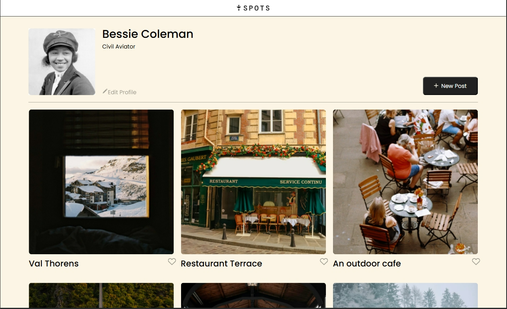
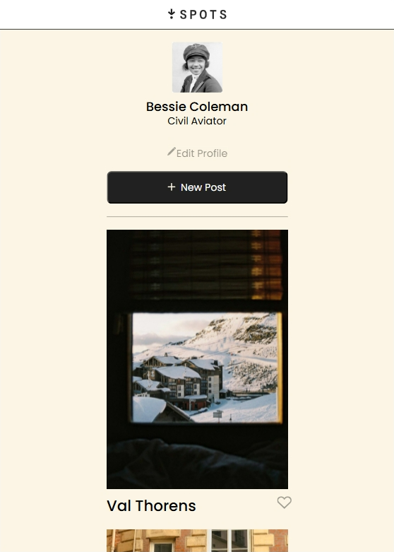
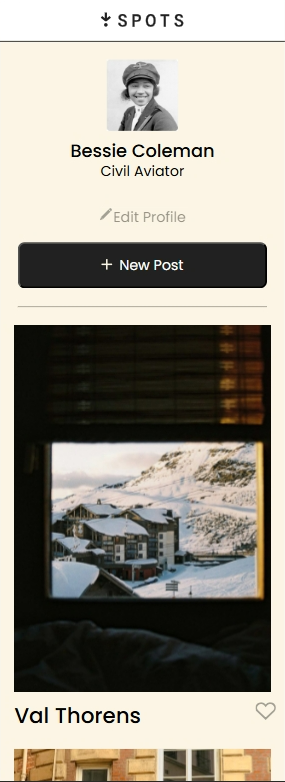

# Project 3: Spots

**Intro**

The name of this project is called SPOTS. There are a variety of elements in this project such as grid display, flexbox, media queries (responsive web design), imported font faces (Poppins), hover effects on buttons, within three main sections of the webpage header, content and footer. It contains 6 different images with a property to hide overflowing text depending on the screen size from 320px to 1440px. Flexbox intiates at 627px. The website was developed on Edge and tested on Chrome and Firefox.

The project's name - DONE
A description of the project and its functionality - DONE
A description of the technologies and techniques used - DONE
Pictures, GIFs, or screenshots that detail the project features (highly recommended) - MAYBE DONE?
The link to your deployed project on GitHub Pages - NOT DONE

- [Link to the project on Figma](https://www.figma.com/file/BBNm2bC3lj8QQMHlnqRsga/Sprint-3-Project-%E2%80%94-Spots?type=design&node-id=2%3A60&mode=design&t=afgNFybdorZO6cQo-1)
