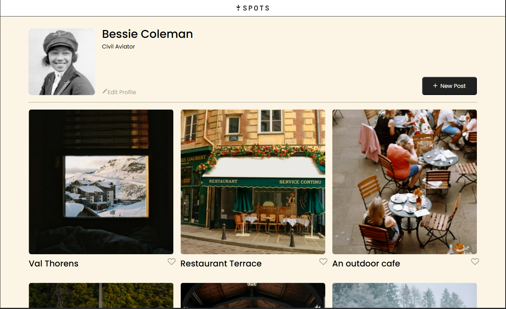
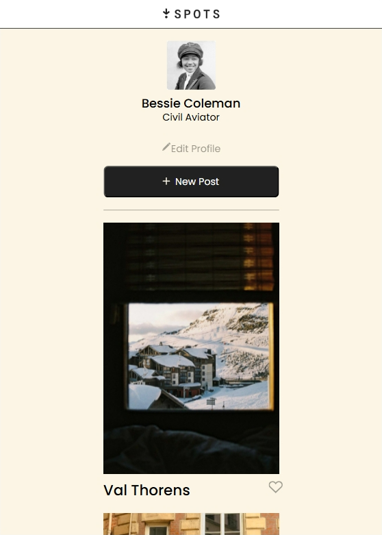
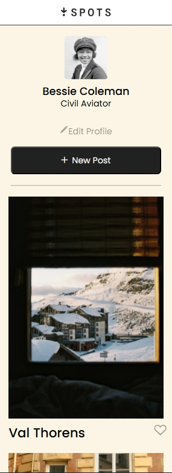

# Project 3: Spots

This is an image sharing site titled "SPOTS"

## Description

The name of this project is called SPOTS. There are a variety of properties in this project such as grid display, flexbox, media queries (responsive web design), imported font faces (Poppins), hover effects on buttons, within three main sections of the webpage header, content and footer. It contains 6 different images with a property to hide overflowing text depending on the screen size from 320px to 1440px. Flexbox intiates on all sections of the page at 627px. The website was inspected and viewed on Edge and tested in Chrome and Firefox. I used VSCode and Gitbash to develop and commit and push changes.

## Tech Stack

HTML
CSS
JavaScript (ES6 modules)
Webpack
Fetch API
BEM
GitHub Pages deployment

## API Endpoints

GET /users/me
PATCH /users/me
PATCH /users/me/avatar
GET /cards
POST /cards
PUT /cards/:id/likes
DELETE /cards/:id/likes
DELETE /cards/:id

## Screenshots

## Deployment

This webpage is deployed to GitHub Pages.

-Deployment Link: https://pruddiman.github.io/se_project_spots/index.html

- [Link to the project on Figma](https://www.figma.com/file/BBNm2bC3lj8QQMHlnqRsga/Sprint-3-Project-%E2%80%94-Spots?type=design&node-id=2%3A60&mode=design&t=afgNFybdorZO6cQo-1)

## Videos

https://www.loom.com/share/f8ec42d2e16e418eb3e29eb45b7519c9?sid=f601876b-28a3-465c-ae5e-841b058bbf10

https://1drv.ms/v/c/b954ec37cb334643/IQARs5ehWk_hR71TrsNk9OG5AYRdL6BJcDd7H3nqFBvTj5g?e=FhLsBL
